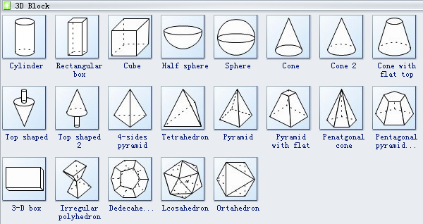

🧡 Let's have fun & build vocabulary for our language. Suggestions are put under bullet list (point form). We will keep adding new constructive suggestion from you guys.

---

💛 If you want to search for a specific keyword, you may use hashtag. Eg: #color 

---
[ba](ba.md) [[po]] = `this is a test`

***

数字 #Number

算数 Calculate/Compute

- `kira`

- `kaoa`

- `suana`

- 

- 

数学 Mathematics

- 算数+学科/领域 (Calculate + Subject/Field)

Fraction

- (1 over 2)

- (1 divided by 2)

Equal = Same

- `sam`

- `seim`

---

颜色 #Color (noun)

- `reyebui`(Red + Yellow + Blue)
  - `reyebuv` = Colorful (adjective)
  - 

🔴 Red 

- `re` 

- `ed` 

- `rod`

- `honged`

- 

🟡 Yellow 

- `ye`
- 

🔵 Blue 

- `bu`

- `brud`

- `laned`

- `odid`

- 

Orange = 🔴+🟡

- `reyev`(re + ye + v)

Green = 🟡+🔵

- `yebuv`(ye + bu + v)

Violet = 🔵+🔴 

- `burev`(bu + re + v)

Reddish orange = 🔴+🔴+🟡

- `rereyev`(re + re + ye + v)

Yellowish orange = 🔴+🟡+🟡

- `reyeyev`(re + ye + ye + v)

Purple = 🔵+🔴+🔴

- `burerev`(bu + re + re + v)

Indigo = 🔵+🔵+🔴

- `buburev`(bu + bu + re + v)

White

- `waid`

- (All + Rainbow)

- 

⚫ Black

- `xiwaid`(xi + wai + d)= Opposite of White (`wai`)

- (All + Color)

Pink

- `rexiwad` (Red + White)

Brown 

- `rexiwad`(Red + Black)

Yellow-brown = ⚫ + 🟡

Rainbow 🌈

- `tonreyebui` (7 + Color)

---

上 Up || 下 Down

- `ap`

- `shang`

- Top (末端End + Up)
  
  - `moap` (`mo` + `ap`)
  
  - `enap` (`en` + `ap`)

- North (方向Direction + Up + `u`)
  
  - `dirapu` (`dir` + `ap` + `u`)

- Bottom (末端End + Down)
  
  - `moxiap` (`mo` + `xiap`)

- South (方向Direction + Down + `u`)

- East (方向Direction + Right + `u`)

- 

左 Left || 右 Right

里 Inside || 外 Outside

入口 Inlet || 出口 Outlet

之间 Between || 之外 Outside

过去 Past (Time)

- `biq`

- 

未来 Future (Time)

- `bip`

- 

---

程度

最好 Most, extreme, top, bottom

更加, 更好

比较好

---

解剖学 #Anatomy

内脏 internal organs

心脏 Heart

- (Blood + Pump)

- (Human + Pump)

- 

肝脏 Liver

- (Human + Chemical)

肺脏 Lung

- (Human + Bag)

脾脏 

肾脏 Kidney

- (Human + Filter)

- 

尿 Urine

- (Human + Dirt + Liquid)

粪便 Poop

- (Human + Dirt)

---

其他 Miscellaneous:

Any

Either

Neither

请求, 命令, 给意见的时候 Requesting, Ordering, Giving advise:

需要 Need

- = Lack?

想要 Want (Desire)

- `deza` 

| 请求词   | 意思                 |
| ----- | ------------------ |
| `ach` | 我愿意 I'm willing to |
| `ech` | 希望 hope            |
| `ich` | 可以 You could       |
| `och` | 应该 You should      |
| `uch` | 必须/一定要 You must    |

---

衣服 Clothing = Cover

* Protect + Body

* Cover + Body

* 动词 Verb = 穿衣 To wear (cloth)

* 

帽子 Hat: 

- (Head + Cover)
- (Top + Cover)
- (Head + Cloth)

上衣 Shirt:

- Outer + Shirt = 外套 Coat
* Inner + Shirt = 内衣 Bra

* 

裤子  Pant

Inner + Pant = 内裤 Panties

- 鞋子  Shoes
* 保护+脚  Protect + Foot

* 

---

情绪 #Emotion

- (Living + Energy + Movement)

- (Energy + Movement)

- (Movement + Energy + Human)

- `emo`

- 

愉快 Joy

- (Smooth + Emotion)

- 

开心,释怀 Happy:

- (Expand/Open + Emotion)
- 

恐惧 Fear

- (收缩Shrink + Emotion)
- 

紧张 Anxiety

- (长久Long-term + 收缩Shrink + Emotion)
- 

爱 Love

- (一体One + 私我Private self)

- (無Without/No + 私我Private self)

- 

喜欢  Like

- (Attract + Emotion)

- (Toward oneself + Emotion)

- (Come + Emotion)

- 

讨厌 Dislike (Opposite of like)

- `xi` + Like

- (Repel + Emotion)

- 

憎恨 Hate:

- (Extreme + Dislike)

- (Extreme + Repel + Emotion)

- 

兴奋 Excited:

- High + Emotion

- Up + Emotion

- 

伤心 Sad:

- (Down + Emotion)

绝望 Depressed:

- (Bottom + Emotion)

尊敬 Respect

- 敬礼+情绪 Salute + Emotion

- 

---

形状 Shape

圆球 Sphere/Round/Circle

- `bo`

方 Square

三角形 Triangle

椭圆/蛋  Oval/Egg

表面 Surface

平 Flat

凹 Concave

凸 Convex

条状 Tube

面条状 Noodle

空的 Empty

有洞的 Hole

---

Texture

粗糙 Rough

顺滑 Smooth

---

人物代名词 Pronouns

大家 Everyone/ Anyone/ All

其他人 Others

大众 Public 

人民 The People

人类 Human being / Home Sapiens

---

连词 Conjunctions:

1. 表示并列关系的连词：
   
   1. 和、跟、与、既、及、而、又、Plus, and
   
   2. 一面⋯⋯一面, 同时 Meanwhile
   
   3. ⋯⋯等 etc

2. 表示选择关系的连词：
   
   1. 或、或者、还是 Or, Either...or

3. 表示转折关系的连词：
   
   1. 但是、不过 But
   
   2. 虽然 Although
   
   3. 然而

4. 表示因果关系的连词：
   
   1. 由于, 因为, 以致 Because
      
      1. 被造成 Be-cause 
   
   2. 因此、所以 So

5. 表示递进关系的连词：不但、不仅、而且、何况、并、且等。

6. 表示条件关系的连词：不管、只要、除非等。

7. 表示假设关系的连词：如果、即使、假若、假如等。

8. 表示目的关系的连词：以、以便、以免、为了等。

9. 表示承接关系的连词：又、便、于是、然后、之后等。

10. 表示比较关系的连词：与其、不如。

---

大自然 Nature

金属 Metal

金 Gold

水 Liquid #Water

- `hzo` (Looks like H2O in chemistry)

- `air`

- `hamo` 

- `ha`

- `wa`

- `ho`

- `shui`

- 

冰 #Ice

- (Water + Solid)

- (硬的Hard + Water)

- 

水蒸气 Vapor

- (Water + Gas)

- 

火 #Fire

- `fi`

- `huo`

- `fai`

- 热,高温 High temp

- Bright

- (高Up + 温度Temp + 亮Bright)

- 

土 Ground/Earth

生物学 Biology

活物 Living thing 

动物 #Animal

- (动Moving + Living)

- 

野生 Wild/Undomesticated

犬科 Canis 

狼 Wolf

- (Wild + Canis)

狗 Dog 

- (Home + Canis)

猫科 Felid

家猫 #Cat 

- (Home + Felid)
- `miaoyi` (`mi + ao + yi`)

老虎 Tiger

- (花纹Stripped + Felid)

狮子

- (Hairy + Felid)

猎豹

野兽 Beast

- (Wild + Living)

牛 Cow

马 Horse

山羊 Goat

绵羊 Sheep

老鼠 Mouse

猴子 Monkey

- (similar + human)

鸡 Chicken, 鸡肉 

猪 Pig,  猪肉 pork

---

植物 #Plant

树 Tree

花 Flower

木 Wood

蔬菜 Vegetable

- `cai`

- `vegi`

- 

Cabbage

胡萝卜 Carrot

- `reyecai`(Orange + Vegetable)

- `reyevegi`(Orange + Vegetable)

- 

Broccoli

- (Tree + Vegetable)
  
  - Looks like a tree

- 

食物 Food

- `fud`

- `xhi`

肉类 Meat (Chicken, Fish, Pork, Lamb, Beef etc)

鸡蛋 Chicken egg

- (Chicken + Oval)

- (Chicken + Egg)

- 

面包 Bread

披萨 Pizza

蛋糕 Cake

玉蜀黍 Corn

水果 #Fruit

苹果 Apple

- (Red + Fruit)

橙子 Orange/ Citrus

米饭 Rice

意大利面 Spaghetti

- (面条状 + Food)

---

动词 #Verb

动作 #Action

是 Am/Is/Are/Was/Were

- `ya`

- `ia`

- `bi`

- `be`

移动 Move:

- Move + Machine/Tool = 交通工具 Vehicle/Transport

Method, doing, practice

---

金融 Finance

钱,货币 Money, Currency

- `dui`

- `koi`

- `mani`

- 

价钱 Price

买卖 Buy & Sell 

起价 Price goes up

便宜点 Cheaper please

汽油 Gas (Fuel)

银行 Bank

---

电子 Electron

电器 Electronics

电脑 Computer / PC:

- `pixi`

互联网 internet:

- `internei`(`in + ter + ne + i`) = (Mutual + Connect + Net)

洗衣机 Washing machine

电视 TV

- `tivi`

keyboard

mouse

motherboard

RAM

Smartphone

Plug

Socket

Earphone

- (Electric + Ear)

Speaker

iPad

iPhone

---

Kitchen

Soup

Spoon

Fork

Plate

- (Flat + Contain)

Cup

- (Liquid + Contain)

Bowl

- (Soup + Contain)

---

人际关系 Social relationship:

社会 Society

- 养育者 People who raise me

- 父亲 Father = Parent (masculine form)

- 母亲 Mother = Parent (feminine form)

- 父母(两人) = Parent (plural form)

- 亲生父母

- 养父母

- 

家庭 Family:

* `eni` (`en` + `i` + `i`) = (3 + Human)
  
  * We need more at least 3 persons to form a family.

* 🧍‍♂️ + 🧍‍♂️ + 🧍‍♂️

* House + Person(s)

* Roof + Person(s)

* Roof + Three + Person(s)

* 

爷爷/奶奶 Grandpa/ma

- (Previous + Father)

- great(xN) grandpa = previous (xN) + previous + father + #
  兄弟姐妹 Sibling

- 

堂/表哥Cousin

father + Sibling + Children

孩子 Children/ Offspring

老板 Boss/Employer

- (Human + Money)

- (Hand + Money)

- 

员工 Employee

- (Money + Human)

- (Money + Hand)

- 

专业 Profession

职业 Occupation

执法者/警察 Police

医生 Doctor

- (Positive + Body)

病人 Patient

- (Negative + body)

律师 Lawyer

---

疑问 Enquiries

- `wa`

- `va`

- `at`

- `wat`

- `xha`

- `apa`

- 

What, what thing?

Who, what person?

Where, what place?

When, what time?

How, what happened?

How, what action?

多少钱 How much, what amount?

Why, what cause?

插話 Interjection
Hi
早安 Good morning etc
Namaste 
小心 Watch Out!
惊讶 Oh My God!
再见 Bye

重量 Mass

科学 Science
动物 Animal
植物 Plant
机器 Machine (includes all electronics)

---

住 Stay at

里面 Inside

房子 House

家 Home (House + Family)

休息 Rest (Stop + Activity/Action)

睡觉 Sleep (Horizontal + Rest)

床 Bed (Sleep + Location) 

---

动词 Verb

拥有 Have

- `hava`

- `youa`

- `yoa`

- 

运动 Exercise

- (Joy + Move + Body)

游戏 Play

- (Joy + Action)

- 

行 Transporting, Moving
移动箱子/搬家Move object (eg: box, house)
行动 Get into action
演戏/表演Acting/ performing
拒绝 Reject
接受 Accept
骂人 Scold

情绪 Emotion:
快乐 Happy
伤心 Sad
恐惧 Fear
愤怒 Angry
紧张 Anxious
呕吐 Disgust
疯狂 Crazy

学校 School:
师生 Teacher/ Student

帮助 Help
发掘 Explore
发现 Expose
手枪 Gun (sadly nowaday we have to teach student how to protect themselves from guns)

---

心理学 Psychology

哲学 Philosophy

真相 Truth

记住 Remember

思考 Think

念头 Thought

功课 Homework

学习 Learn 

忘记 Forget

Mind

Intention

意志 Will

Ego

---

物理 Physics

重量 Mass

加速 Accelerate

Force = ma

能量 Energy

* E=mc2
  
  * (Mass + Speed + 2)

---

化学 Chemistry

气体 Gaseous state

液体 Liquid state

- Water

固体 Solid 

Atom

Nuclear

Chemical reaction

金属 Metal || Non-metal 

Metalloid (Semi-metal)

---

外来的 Foreign

外星人 Alien

拉丁语字母 Latin alphabet

国家 Nation

爱国 Patriotic

分裂 Discrimination

暴力 Violence

人道 Humanity

- `xovi`
- `ibi` 

---

Any national, cultural & racial name should be shelled according to their native pronunciation (as in what they would like to address themselves as). Eg: Europe should be shelled as `*Yiurop` (instead of `*Europe`) & China should be shelled as `*Zhong-Guo`(instead of `*Qhai-Na`). Pronunciation should be based on official pronunciation, instead of slang. Please let us know if it is shelled incorrectly. 

`*` sign let the users know it is a transliterated word.

USA

- `*Yiu-Aes-Ei`

American

- `*Aemaeriken`

中国 China

- `*Zhong-Guo`

中国人 Chinese

- `*Zhong-Guo-Ren`

Россия

- `*Raxie`

Bhārat Gaṇarājya

- Europe

- `*Yiurop`

日本国 Japan

- `*Nihonkoku`

Michael Jackson

- `*Maige-Jaeksen`

Eskimo

- `*Inuit`

London

- `*Landen`

Nantes (France)

- `*Not` 

Paris (France)

- `*Pari` 

Bristol (England)

- `*Bristel` 

Nike (brand)

- `*Naiki`

Croissant (French food)

- `*kuaxong`

---

科学 Science

哲学 Philosophy

地球 Earth

- Ground

- Down

- Land

- 

海洋 Sea

- (Water + Earth)

- (Earth + Water)

- 

陆地 Land

方法 Method

Logic

Evidence/Proof

Observation

Hypothesis

客观 Objectivity

宇宙 Universe

All 

Everything

---

健康,舒畅,通畅 Healthy, Flowing smoothly

Healthy body = Blood & energy flow smoothly within biological system

- Unhealthy body = Clot
- 通则不痛,痛则不通

Healthy mind = Thought flows smoothly = Open minded

- Unhealthy mind = Stuck thought/mindset

Healthy emotion = Feeling smooth = Positive & happy

- Unhealthy emotion = Feeling stuck, depressed

---

nutrition

Organic || Inorganic

蛋白质 protein

- (Nitrogen + Organic)

amino acid

脂肪 fat

- `fat`
- (Above + Water)

碳水化合物 carbohydrates

- `qahzoi`(`qa + hzo + i`) = (Carbon + Water)

sugar

- `xui`
- `xuit`
- (Sweet + carbohydrate)

glucose

sucrose

糖尿病 diabetes

---

Astronomy
Universe

Galaxy

- (Stars + Group)
- (Stars + Location)

Milky way

- (Local + Galaxy)

Gravity

- Attract

Black hole

- (Black + Attract)

Star

- (Bright + Hot)

Sun

- (The + Star)

Earth

- (The + Ground)

Orbit

- (Rotate + Moving)
- (Rotate + Around)

Moon

- (Orbit + Earth)
- (Earth + Orbit)

Planet

- (Rotate + Star)

Mars

- (Red + Planet)

tosol (today in Mars)

solmorrow (tomorrow in Mars)

- (Next + Rotation + Day)

yestersol (yesterday in Mars)

- (Previous + Rotation + Day)

Jupiter

Mercury

- (Fastest + Planet)

etc

---
